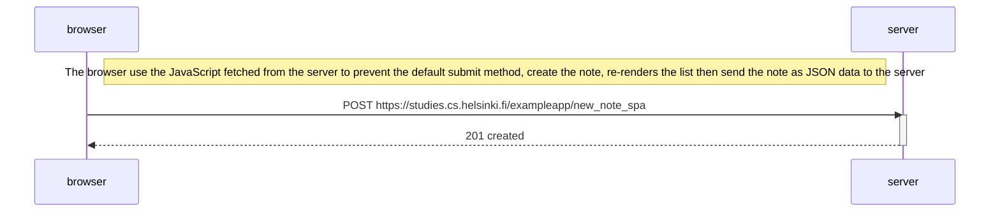

```mermaid
sequenceDiagram
    participant browser
    participant server

    Note right of browser: The browser use the JavaScript fetched from the server to prevent the default submit method, create the note, re-renders the list then send the note as JSON data to the server

    browser->>server: POST https://studies.cs.helsinki.fi/exampleapp/new_note_spa
    activate server
    server-->>browser: 201 created
    deactivate server
```
